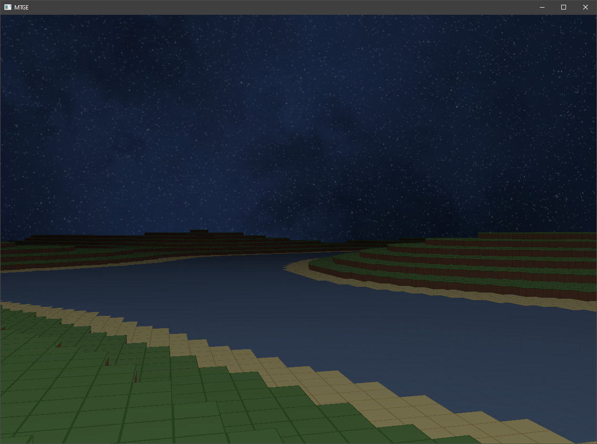

# MT-Game-Engine
A voxel game engine written in C++ with OpenGL

## Dependencies
* [stb_image.h](https://github.com/nothings/stb/blob/master/stb_image.h): For image loading
* [GLFW](https://github.com/glfw/glfw): For handling windows and user inputs
* [GLEW](https://github.com/nigels-com/glew)

## Features
* **Textures**
    * Loading textures from a texture atlas
    * Skyboxes
* **Shaders**
    * Wrapper for shader loading and compilation
    * Default shaders for basic rendering
* **Math tools**
    * Built-in linear algebra library
    * Terrain generation with Perlin noise
    * Frustum culling
* **Control**
    * Camera control
    * Player control
        * Gravity
        * Collision detection
* **Chunk-based rendering**
    * Queued chunk loading
    * Chunk storage via std::unordered_map
        * Accessed through (x, y) position hash
